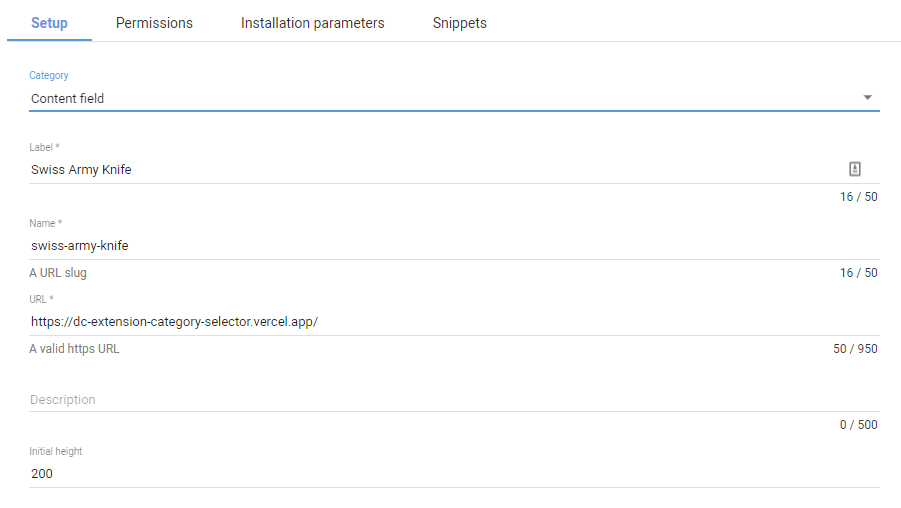
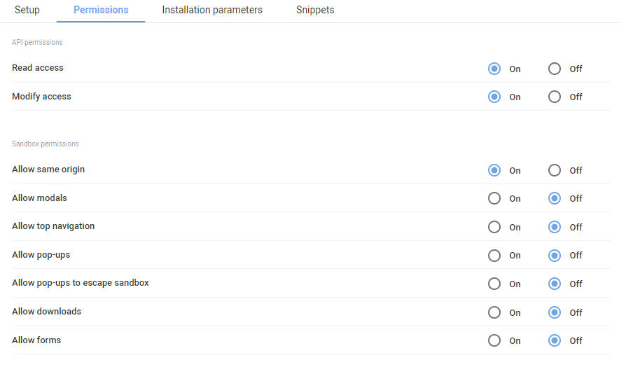
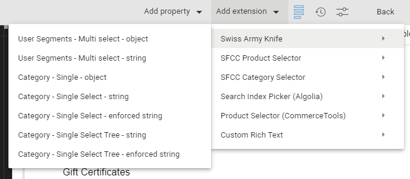

[](https://amplience.com/dynamic-content)

# eComm Swiss Army Knife

`dc-extension-ecom-swissarmyknife` is an extension written in React/MUI/Typescript for Amplience Dynamic Content that provides an eassy way to interface with 'X' ecomm platform for multiple use cases. The extension currently supports SFCC, with more eComm support in the works. Here's a list of high-level current/future features:

## Supported e-comm platforms
- Salesforce Commerce Cloud
- Commercetools (future release)
- BigCommerce (future release)
- TODO etc?

## Supported features
- Category selector
- User Segment selector
- Campaign/Promo selector (future release)
- Product Finder/Selector (future release)

## Getting Started with Swiss Army Knife

There are many ways one may use a Swiss Army Knife, but first you'll want to register the extension against an Amplience Dynamic Content HUB. Login to your Hub and head to Development > Extensions and click the "Register" button.


### Base Extension Setup 
Under the setup tab, enter the following (URL should be `https://dc-extension-category-selector.vercel.app/`) 



### Extension Permissions Settings
Under the Permissions tab, select the following:



### Extensions Installation Parameters

Installation Parameters is where you'll enter your E-comm platform-specific environment settings and credentials. If you're on SFCC, they will look like the following:

``` bash
{
  "api_url": "https://YOURINSTANCE.dx.commercecloud.salesforce.com",
  "auth_url": "https://account.demandware.com/dwsso/oauth2/access_token",
  "api_token": "clientId:secret",
  "client_id": "xxxxxxxxx-xxxx-xxxx-xxxx-xxxxxxxxxxxx",
  "client_secret": "TheClientPWYouSetInAccountMgr"
  "site_id": "RefArchGlobal",
}
```
N.B. that the `api_token` needs to be base64 encoded.

### Extension Snippets

Since the Swiss Army knife requires a number of "Instance Parameters", we recommend providing a number of extension snippets for ease of use and to ensure functionality. By including Snippets in an extension registration, you'll be able to quickly configure properties when you're editing/creating a Content Schema that are automatically associated with an extension.



The Instance Parameters are all included in the snippets and will drive how the extension looks and functions, and what type of data will be retrieved from your e-comm platform. 

Under the Snippets tab, add snippets using each of the following:

#### User Segments - Multi select - object

``` json
{
  "title": "User Segments",
  "description": "Multi-select User Segments and store as {name:string,id:string}",
  "type": "array",
  "minItems": 0,
  "maxItems": 5,
  "items": {
    "type": "object",
    "properties": {
      "id": {
        "title": "ID",
        "type": "string"
      },
      "name": {
        "title": "Name",
        "type": "string"
      }
    }
  },
  "ui:extension": {
    "name": "swiss-army-knife",
    "params": {
      "label": "User Segments",
      "view": "multi",
      "data": "segment",
      "type": "object"
    }
  }
}
```
#### User Segments - Multi select - string

``` json
{
  "title": "User Groups",
  "description": "Multi-select User Segments and store as string",
  "type": "array",
  "minItems": 0,
  "maxItems": 5,
  "items": {
    "type": "string"
  },
  "ui:extension": {
    "name": "swiss-army-knife",
    "params": {
      "label": "User Segments",
      "view": "multi",
      "data": "segment",
      "type": "string"
    }
  }
}
```

#### Category - Single Select - object

``` json
{
  "title": "Category",
  "description": "Single-select Category and store Name,ID as {name:string,id:string}",
  "type": "object",
  "properties": {
    "name": {
      "title": "Name",
      "type": "string"
    },
    "id": {
      "title": "ID",
      "type": "string"
    }
  },
  "propertyOrder": [
    "id",
    "name"
  ],
  "ui:extension": {
    "name": "swiss-army-knife",
    "params": {
      "label": "Category",
      "view": "single",
      "data": "category",
      "type": "object"
    }
  }
}
```

#### Category - Single Select - string

``` json
{
  "title": "Category",
  "description": "Single-select Category and store ID as string",
  "type": "string",
  "ui:extension": {
    "name": "swiss-army-knife",
    "params": {
      "label": "Category",
      "view": "single",
      "data": "category",
      "type": "string"
    }
  }
}
```

#### Category - Single Select - enforced string

``` json
{
  "title": "Category",
  "description": "Single-select Category and store ID as string",
  "type": "string",
  "pattern": "category\/.*",
  "ui:extension": {
    "name": "swiss-army-knife",
    "params": {
      "label": "Category",
      "view": "single",
      "data": "category",
      "type": "string"
    }
  }
}
```
#### Category - Single Select Tree - string

``` json 
{
  "title": "Category",
  "description": "Single-select Category Tree and store ID as string",
  "type": "string",
  "ui:extension": {
    "name": "swiss-army-knife",
    "params": {
      "label": "Category",
      "view": "tree",
      "data": "category",
      "type": "string"
    }
  }
}
```

#### Category - Single Select Tree - enforced string

``` json 
{
  "title": "Category",
  "description": "Single-select Category Tree and store ID as string",
  "type": "string",
  "pattern": "category\/.*",
  "ui:extension": {
    "name": "swiss-army-knife",
    "params": {
      "label": "Category",
      "view": "tree",
      "data": "category",
      "type": "string"
    }
  }
}
```

 
 
 
